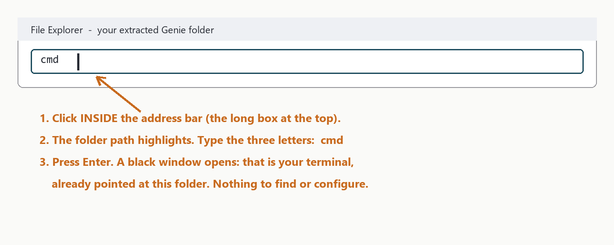
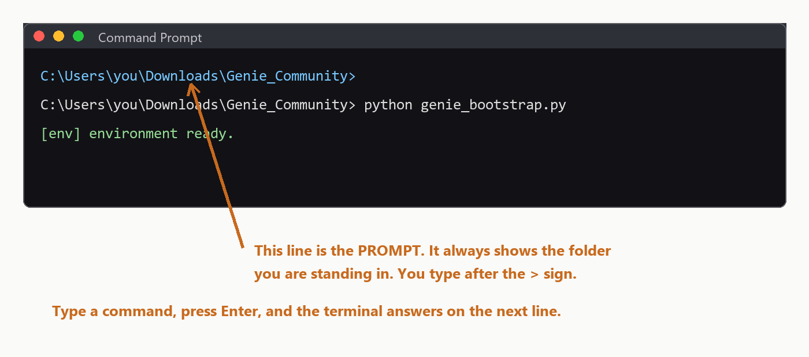
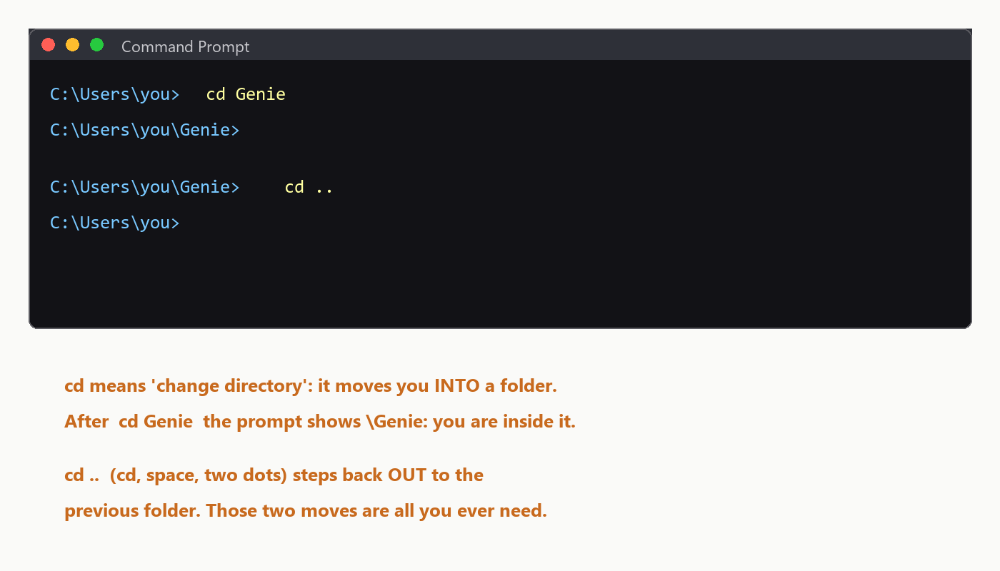
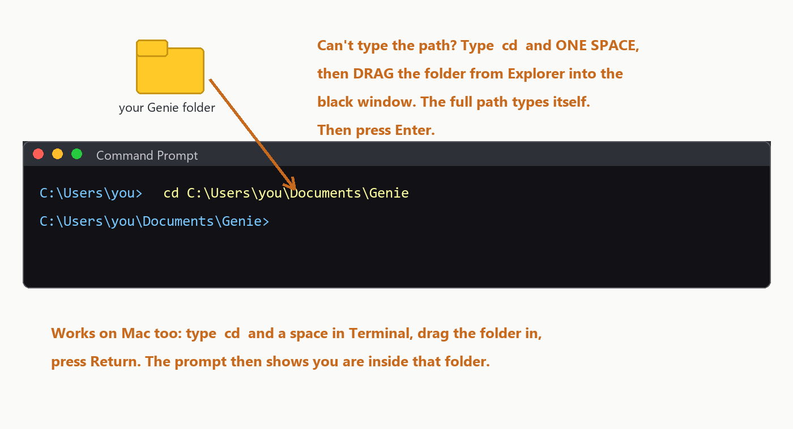

# Genie Installation Guide​‍‍​‌‍‌‌‍‍‌‌‍‌‌‌‍‍‍‍‍‌‍‍‍‌‍‌‌‌‌‍‌‌‍‌​
### Every step explained, for Windows and Mac

This guide assumes nothing. Follow it top to bottom and you will go from
a fresh computer to a working Genie studio. Where Windows and Mac
differ, both paths are given. If anything goes wrong, the Troubleshooting
section near the end almost certainly covers it, and the support group
covers the rest.

---

## What you need before you start

1. **Your Genie Community Edition zip** (it looks like
   `Genie_Community_*.zip`). There is no license key: this edition is
   free.
2. **A Claude account with Claude Code access** (an Anthropic
   subscription that includes Claude Code). Genie's primary engine runs
   on it. If you also have a ChatGPT account, Genie can use its backup
   engine too, but you can start without one.
3. **About 20 minutes.** Most of it is waiting for automatic installs.

---

## Step 1: Install Python (the only thing you install by hand)

Python is the small program that runs Genie's installer. Everything
else installs itself later.

**Windows:**
1. Open your web browser and go to **python.org/downloads**.
2. Click the big yellow button that says **Download Python 3.x.x**.
3. Open the file it downloads (it is in your Downloads folder).
4. VERY IMPORTANT: on the first screen of the installer, tick the little
   checkbox at the bottom that says **"Add python.exe to PATH"**. This
   one checkbox prevents almost every installation problem people have.
5. Click **Install Now** and wait for "Setup was successful", then
   click Close.

**Mac:**
1. Go to **python.org/downloads** and click **Download Python 3.x.x**.
2. Open the downloaded `.pkg` file and click Continue through the
   installer, then Install. Enter your Mac password when asked.

**Check it worked:** open a terminal (next step shows you how) and type
`python --version` (Windows) or `python3 --version` (Mac), then press
Enter. If you see a version number like `Python 3.12.x`, you are ready.

---

## Step 2: Extract your Genie delivery

1. Find the `Genie_Community_*.zip` file in your Downloads folder.
2. **Windows:** right-click it and choose **Extract All...**, then
   click Extract. **Mac:** double-click the zip and it extracts itself.
3. You now have a normal folder with the same name. Open it. You should
   see `Start Genie.bat` and a file called `CLAUDE.md`. If you see them,
   you are in the right place.
4. OPTIONAL BUT TIDY: move this folder somewhere permanent, like your
   Documents folder. Genie will live where you install it.

---

## Step 3: Open a terminal IN that folder

The terminal is just a window where you type commands. You only need
two or three commands, and this guide gives you every one exactly.

**Windows (easiest way):**
1. Open the extracted Genie folder in File Explorer.
2. Click once on the empty space of the address bar at the top (where
   the folder path is shown).
3. Type `cmd` and press Enter. A black window opens, already pointed at
   the right folder. That is your terminal.

**Mac:**
1. Open the extracted Genie folder in Finder.
2. Right-click (or Control-click) the folder name in the path bar at
   the bottom and choose **"Open in Terminal"**. (If you do not see a
   path bar: Finder menu, View, Show Path Bar.)

### How the terminal works (60 seconds, worth reading once)

The black window always shows a line ending in `>` (Mac: `%` or `$`).
That line is the **prompt**, and it tells you two things: **which
folder you are standing in**, and that the terminal is ready. You type
a command after the `>` and press Enter; the terminal does the work
and answers on the lines below, then shows a fresh prompt.

**Moving between folders: the `cd` command.** `cd` means "change
directory", and directory is just the old word for folder. It is the
only movement command you will ever need:

- `cd Genie` moves you **into** a folder named Genie that is inside
  your current folder. Watch the prompt: it now ends in `\Genie`,
  which is how you know it worked.
- `cd ..` (that is: cd, a space, two dots) steps you back **out** to
  the folder above.
- `cd` followed by a full path jumps straight there from anywhere, for
  example: `cd C:\Users\you\Documents\Genie`

**The drag trick (easiest of all).** You never have to type a path by
hand: type `cd`, then ONE SPACE, then **drag the folder** from File
Explorer (Mac: Finder) into the black window. The full path types
itself; press Enter and you are inside. When this guide says "open a
terminal in your Genie folder", this trick is the fastest way: open
any terminal, type `cd `, drag the Genie folder in, press Enter.

Two small comforts: the terminal never does anything until you press
Enter, so you can look at what you typed first; and if a command ever
prints something you do not understand, copy it into the support group
and carry on. Nothing you type from this guide can break your
computer.

---

## Step 4: Nothing to activate

The Community Edition has no installer and no license key. The folder you
extracted IS Genie. Keep the terminal open in that folder and go to Step 5.

---

## Step 5: First start, where everything installs itself

1. In the terminal, move into the installed Genie folder with `cd`:
   type `cd`, one space, then either type the folder's location, or simply drag the Genie folder into the terminal window
   (the drag trick from Step 3), and press Enter. The prompt should now
   end in `\Genie`.
2. Type `claude` and press Enter.
   - The very first time, your browser opens and asks you to log in to
     your Claude account. Log in once; it stays remembered.
   - If the terminal says `claude` is not recognized, that is fine: it
     is not installed yet. Type
     **Windows:** `python genie_bootstrap.py`
     **Mac:** `python3 genie_bootstrap.py`
     and press Enter; the bootstrap installs it for you (next point),
     then type `claude` again.
3. The FIRST conversation: type
   **"Genie, run the first-run setup"** and press Enter.
   Genie now sets up everything by itself:
   - installs the apps it needs (Node.js, the engine programs, Google
     Chrome if missing, and a free document converter if you do not
     have Microsoft Word). Windows may show a couple of permission
     pop-ups; click Yes;
   - installs all its Python components;
   - starts filling its design reference libraries in the background.
   You do not need to watch it. It reports when it is done, and it
   never needs doing again.

---

## Step 6: Confirm everything works

Type: **"Genie, standup"**

Genie should introduce itself and give you a status report. That is
your daily command from now on. If you got a standup, the core
installation works. Three short linking steps remain (Codex, VS Code,
and your browser); do them now while you are set up, then your first
book is one message away: see the **"Your First Book in 48 Hours"**
guide included in your Genie folder.

---

## Step 7: Link Codex with Claude Code (Genie's second engine)

Claude Code is Genie's main engine. **Codex** (which runs on your ChatGPT
account) is its second engine: Genie drives it automatically for cover
art, A+ Content images, and as a backup writer. Linking the two takes
two short commands, once.

1. **Sign Codex in.** In your terminal (any folder), type:

   `codex login --device-auth`

   and press Enter. It prints a web link and a short code. Open the link
   in your browser, type the code, and sign in with your **ChatGPT
   account**. When the terminal says you are logged in, Codex is ready.
   (If it says `codex` is not recognized, run the bootstrap from Step 5
   first; it installs the Codex program.)
2. **Let Claude Code use it.** Open your terminal in the Genie folder,
   type `claude` and press Enter, and when Claude Code asks whether to
   allow the **codex** helper, approve it. Type `/exit` to leave. That
   approval is remembered.
3. That is the whole link. From now on, when Genie needs Codex (for
   example to generate a cover), it calls it in the background; you
   never open Codex yourself.

---

## Step 8: Install VS Code with Codex and Claude Code (recommended)

VS Code is a free visual workspace. With both extensions installed you
can talk to Genie in a side panel instead of a black terminal window,
and Codex is available in the same place.

1. **Install VS Code.** Go to **code.visualstudio.com**, click
   Download, open the downloaded file, and click through the installer
   (next, next, finish). Mac: drag the app into Applications.
2. **Install the two extensions automatically.** Re-run the bootstrap
   once (in your Genie folder terminal: `python genie_bootstrap.py`,
   Mac `python3`). When VS Code is present it installs the **Claude
   Code** extension and the **Codex** extension for you.
   - Manual fallback: open VS Code, click the Extensions icon in the
     left bar (four squares), search **"Claude Code"** (publisher:
     Anthropic) and click Install; then search **"Codex"** (publisher:
     OpenAI) and click Install.
3. **Open your studio.** In VS Code choose File, Open Folder, and pick
   your `Genie` folder.
4. **Sign both in.** Click the Claude icon in the left sidebar and log
   in with your Claude account; click the Codex icon and log in with
   your ChatGPT account (it may already be signed in from Step 7).
5. Talk to Genie in the Claude panel exactly as in the terminal: start
   with **"Genie, standup"**.

---

## Step 9: Connect your browser (two Chrome extensions)

Genie uses Google Chrome for live work: studying Amazon best sellers,
pulling cover reference images, and generating art. Two extensions link
your apps to the browser. Both are free and take a minute each.

**A. The Claude extension (links Claude Code to Chrome):**
1. Open Chrome and go to the **Chrome Web Store**
   (chromewebstore.google.com).
2. Search for **"Claude"** and pick the extension published by
   **Anthropic** (it is called Claude, sometimes shown as "Claude in
   Chrome").
3. Click **Add to Chrome**, then **Add extension**.
4. Click the puzzle-piece icon at the top right of Chrome, click the
   pin next to Claude so it stays visible, then click the Claude icon
   and **sign in with the same Claude account** you use for Claude
   Code.
5. Done: Genie can now browse with you, research niches live, and pull
   cover references from Amazon.

**B. The ChatGPT extension (links your ChatGPT account to Chrome):**
1. In the same Chrome Web Store, search for **"ChatGPT"** and pick the
   extension published by **OpenAI**.
2. Click **Add to Chrome**, then **Add extension**.
3. Click its icon and **sign in with your ChatGPT account** (the same
   one you used for Codex in Step 7).
4. Also open **chatgpt.com** once in Chrome and make sure you are
   signed in there and stay signed in. That signed-in tab is what lets
   Genie use ChatGPT's image engine in your browser when it designs
   covers.

**C. While you are here, sign in once to the sites Genie works with:**
- **labs.google** (Google Flow, a free image engine) with your Google
  account;
- **kdp.amazon.com** (Amazon KDP) with your publishing account, and any
  other store you publish to (IngramSpark, Draft2Digital, Kobo, Google
  Play Books, Barnes & Noble Press, Lulu).
Genie never asks for or types your passwords; you sign in yourself,
once, and the browser remembers.

---

## Updating Genie later

When a new Community Edition zip is released, your books and settings all
survive:
1. Save the new zip in your Downloads folder (no need to extract it).
2. Open a terminal in your Genie folder (Step 3).
3. Run `python genie_update.py <path-to-the-new-zip>` (Mac: `python3`),
   and it updates your existing install in place.
You never reinstall from scratch and never lose your work.

---

## Troubleshooting

- **"python is not recognized" (Windows):** Python was installed
  without the PATH checkbox. Re-run the Python installer from Step 1,
  choose Modify, and enable "Add python to environment variables". Then
  close and reopen your terminal.
- **"command not found: python" (Mac):** use `python3` instead of
  `python` in every command.
- **The terminal opened in the wrong folder:** type `cd` followed by a
  space, then drag the Genie folder from Explorer/Finder into the
  terminal window and press Enter. That moves you into it.
- **Permission pop-ups during first run:** those are Windows asking to
  install Node.js or Chrome. Click Yes. If you clicked No by mistake,
  run `python genie_bootstrap.py` again.
- **Claude asks me to log in again:** normal after a long time or a
  password change. Log in and continue.
- **`codex login` says command not found:** run the bootstrap once
  (`python genie_bootstrap.py` in the Genie folder), then try again.
- **The Codex sign-in link expired:** just run
  `codex login --device-auth` again; a fresh code is issued each time.
- **Cannot find an extension in the Chrome Web Store:** check the
  publisher name (Anthropic for Claude, OpenAI for ChatGPT). Names and
  icons change now and then; the publisher is the reliable marker.
- **Genie says the browser is not connected:** open Chrome, click the
  Claude extension icon, and make sure it is signed in; then try again
  in the same session.
- **A step failed and Genie mentioned a "blocker":** Genie keeps
  working around it and will retry. If it persists, copy the exact
  message into the support group.

---

## Support

Post in the **Genie WhatsApp support group**. Join here (also linked in
your welcome email):

`https://chat.whatsapp.com/B7VyRrEM9fp7jkzzvSRJIj`

Say which pack you have (Starter / Pro / Max), which step you are on,
and paste the exact message you see. Screenshots help.

**Welcome to Genie. Your studio is ready.**
​‍‍​‌‍‌‌‍‍‌‌‍‌‌‌‍‍‍‍‍‌‍‍‍‌‍‌‌‌‌‍‌‌‍‌​
